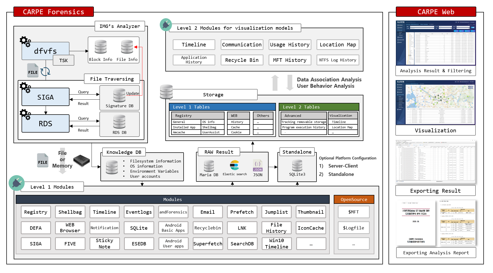

# [CARPE Forensics](http://forensic.korea.ac.kr/dfrc-project-4.html)

## INTRODUCTION

Digital Forensic Integration Framework. Because this framework is open source, it can be used to build digital forensic infrastructure through ecosystem building. In addition, verification of the code can evolve to a reliable level of code, and development can be carried out with user requirements.
For the digital forensic analyst, this technology enables efficient work in the analysis process through automated modules. In the developer's view, it can be used to develop not only digital forensic research but also own tool by utilizing open source.
Recently, the processing technology for large-capacity data is developed for each module, and not only related data analysis but also keyword search, string extraction, and file fragment recombination are provided.

## OVERVIEW

#### CARPE Forensics Architecture

##### Analyze Digital Forensic Image & Extract Artifacts
In this course, we analyze the image data using plaso and RDS (Reference Data Sets) and perform the process of extracting the desired artifacts by the user. The extracted artifacts are then used as input values of the big data processing.

##### Process Big Data
In this course, correlation analysis and string indexing are performed based on the result data of image analysis and artifact extraction. The results analyzed in the whole process are stored in a database. The types of databases include a graph database, a time series database, and a relational database. The database data is finally visualized and displayed to the user.

##### Ohter information
* Contact information: http://carpeforensics.org
* How to build: https://github.com/dfrc-korea/carpe/wiki/Building
* Documentation: https://github.com/dfrc-korea/carpe/wiki/Usage